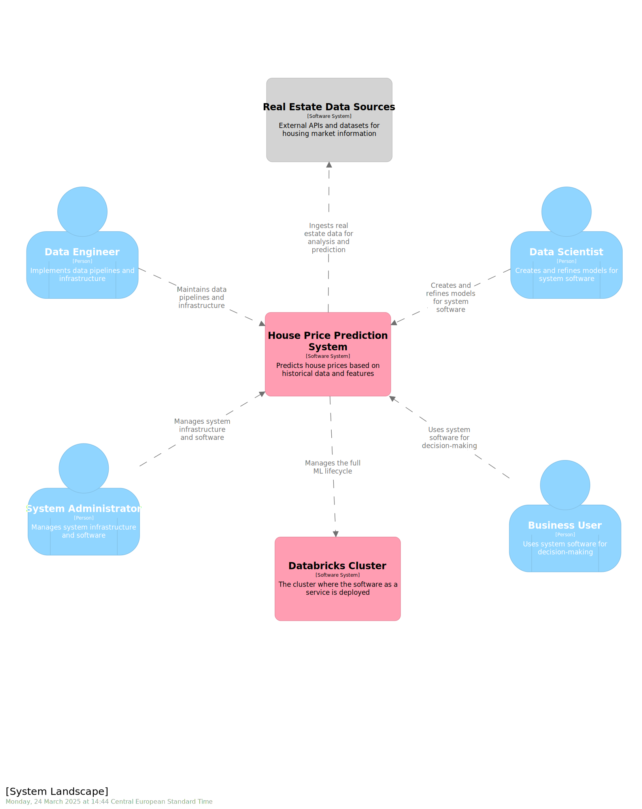

<h1 align="center">
Marvelous MLOps End-to-end MLOps with Databricks course

## Intro


Use the dataset housing-prices

## Practical information
- Weekly lectures on Wednesdays 16:00-18:00 CET.
- Code for the lecture is shared before the lecture.
- Presentation and lecture materials are shared right after the lecture.
- Video of the lecture is uploaded within 24 hours after the lecture.

- Every week we set up a deliverable, and you implement it with your own dataset.
- To submit the deliverable, create a feature branch in that repository, and a PR to main branch. The code can be merged after we review & approve & CI pipeline runs successfully.
- The deliverables can be submitted with a delay (for example, lecture 1 & 2 together), but we expect you to finish all assignments for the course before the 25th of November.


## Set up your environment
In this course, we use Databricks 15.4 LTS runtime, which uses Python 3.11.
In our examples, we use UV. Check out the documentation on how to install it: https://docs.astral.sh/uv/getting-started/installation/

To create a new environment and create a lockfile, run:

```
uv venv -p 3.11 venv
source venv/bin/activate
uv pip install -r pyproject.toml --all-extras
uv lock
```

## C4 model architecture for managing House Price Prediction ML lifecycle


Adv: lead to better communication and clarity between the different teams involved in this MLOps solution
I used https://structurizr.com/ to code this architecture .


## 📊 Weekly Development Progress

### Week 1: Data Preparation and Preprocessing

✨ Key Features:

- Comprehensive  `DataProcessor` class for house price dataset preparation
     - The  `DataProcessor` class handles all aspects of preparing house price data for ML:
        - Initialization: Takes a pandas DataFrame, configuration object, and SparkSession
        - Preprocessing: Handles missing values, data type conversion, and feature selection
        - Data Splitting: Divides data into training and test sets
        - Catalog Integration: Saves processed data to Databricks tables with timestamps
        - Delta Lake Features: Enables Change Data Feed for data versioning

- **Key Methods**
- preprocess() --
Converts numeric columns using pd.to_numeric()
Handles missing values in "LotFrontage" and "GarageYrBlt"
Creates derived feature "GarageAge" from "GarageYrBlt"
- split_data() -- Divides processed data into training and test sets. Configurable test size and random state parameters
Returns separate pandas DataFrames for train and test
- save_to_catalog() -- Converts pandas DataFrames to Spark DataFrame.


### Week 2: Feature Engineering and Model Training

✨ **Key Features:**

#### Three Model Implementations

| Model | Description |
|-------|-------------|
| **BasicModel** | Trains LGBMRegressor with epoch-level MLflow logging and model registry |
| **CustomModel** | Production-ready model with custom `HousePriceModelWrapper` for formatted predictions, code paths, and conda dependencies |
| **FeatureLookUpModel** | Feature-engineered model using Databricks Feature Engineering Client with feature tables, UDFs, and automated model promotion |

#### Common Methods

- `load_data()` - Load train/test sets from Delta tables
- `prepare_features()` - ColumnTransformer pipeline with OneHotEncoder
- `train()` - Train LGBMRegressor model
- `log_model()` - Log to MLflow with metrics (MSE, MAE, R²)
- `register_model()` - Register in Unity Catalog with aliases
- `load_latest_model_and_predict()` - Load and generate predictions

#### FeatureLookUpModel Specific Methods

- `create_feature_table()` - Create UC feature table with primary keys and CDC
- `define_feature_function()` - Define Python UDF for calculated features
- `feature_engineering()` - Create training set with FeatureLookup and FeatureFunction


### Week 3: Model Serving and Deployment

✨ **Key Features:**

#### Model Serving Implementation

| Component | Description |
|-----------|-------------|
| **FeatureLookupServing** | Manages model serving endpoints with integrated feature lookup, online tables, and real-time predictions |
| **Online Table Creation** | Creates and maintains online feature tables from Delta tables for low-latency feature retrieval |
| **Serving Endpoint Deployment** | Deploys/updates REST API endpoints for model inference with feature engineering support |

#### Key Methods

- `create_online_table()` - Create online table from feature table for real-time feature serving
- `deploy_or_update_serving_endpoint()` - Deploy or update Databricks model serving endpoint
- `call_endpoint()` - Call endpoint via REST API with Bearer token authentication

#### Workflow

1. Load project configuration from YAML
2. Initialize `FeatureLookupServing` with model name and endpoint configuration
3. Create online table for low-latency feature lookups
4. Deploy serving endpoint with feature lookup integration
5. Make predictions via REST API with `dataframe_records` format
